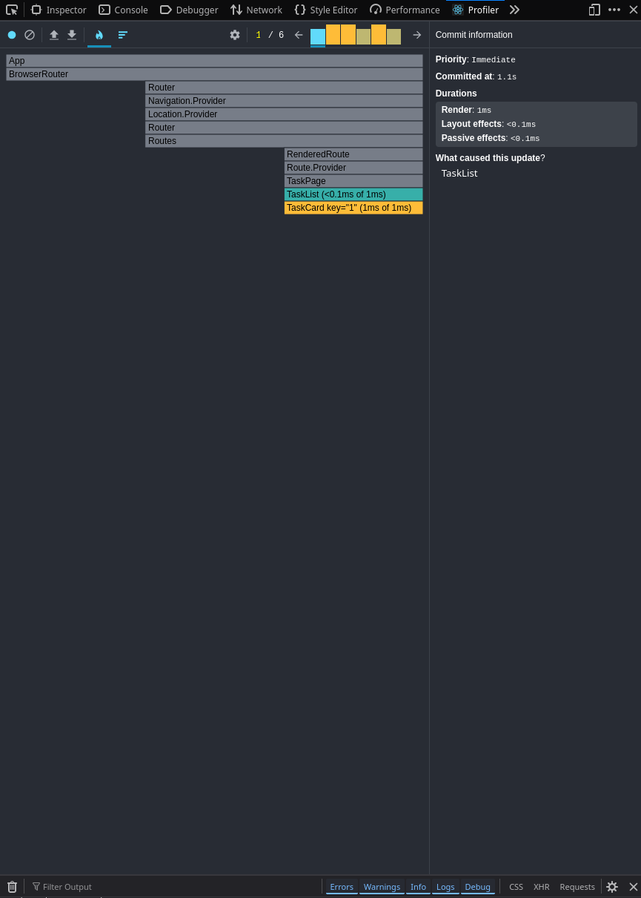
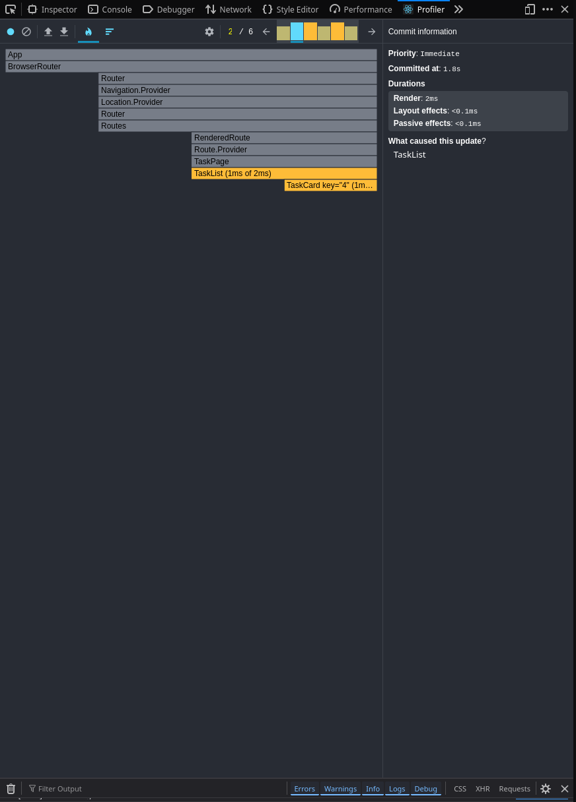
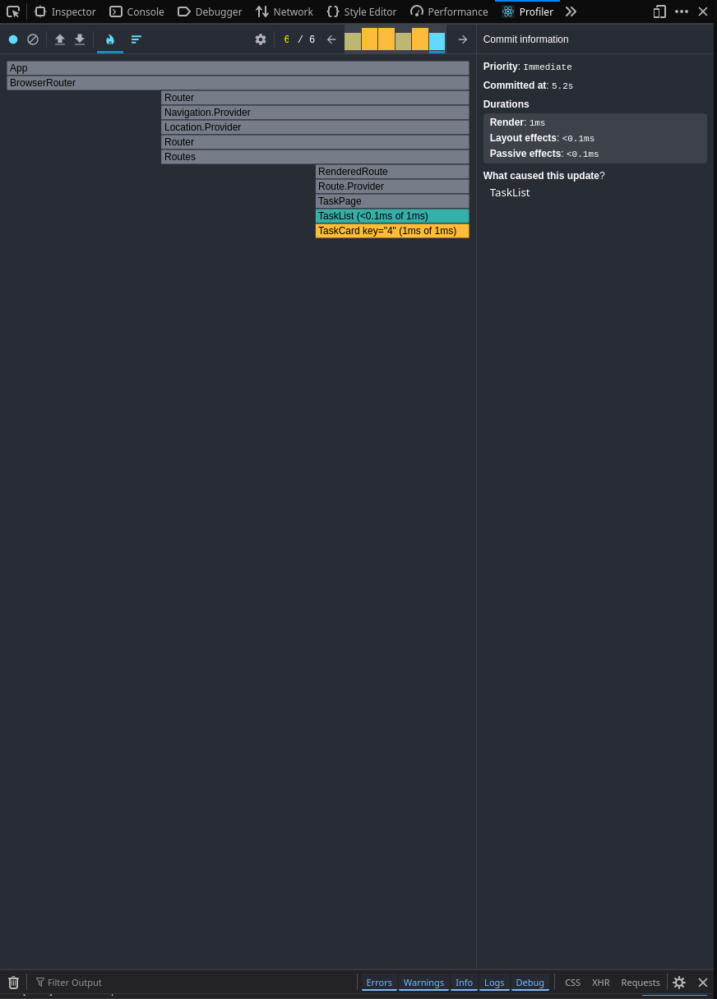
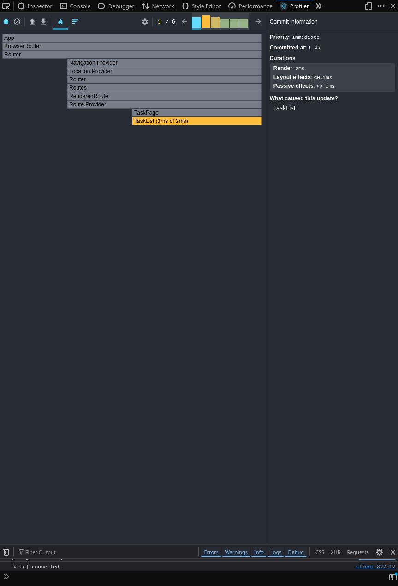
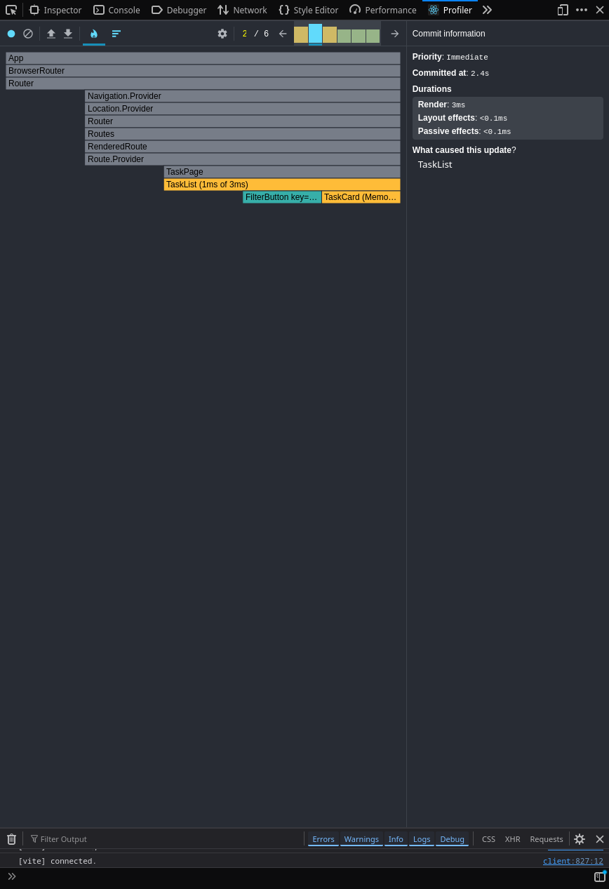
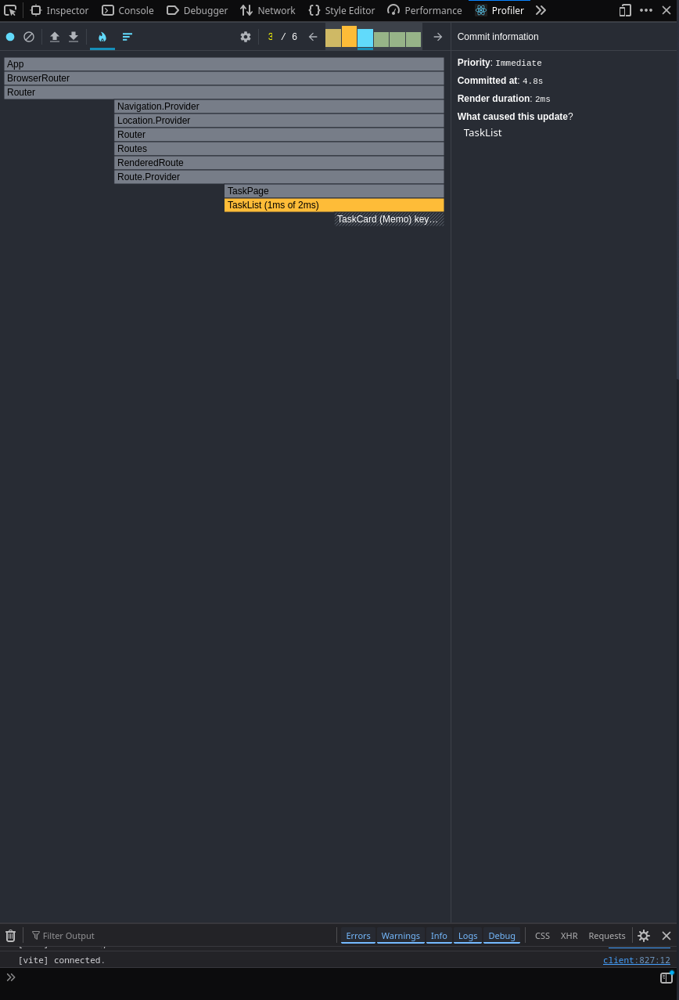
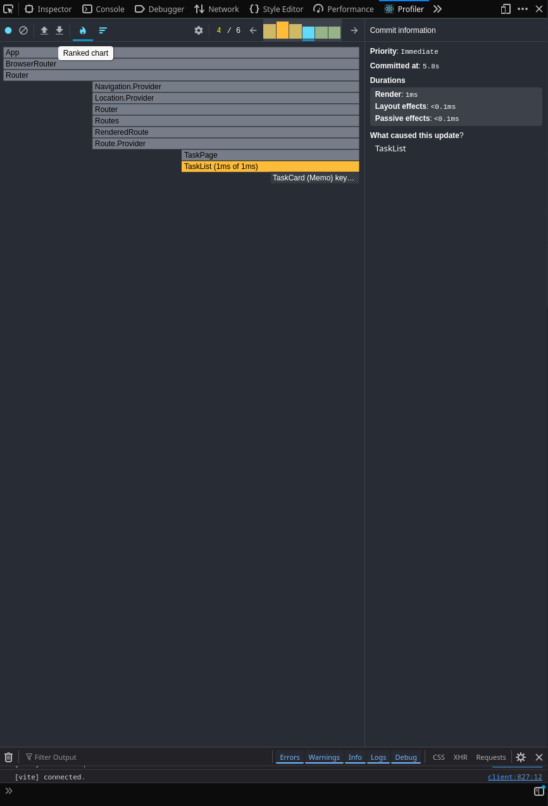
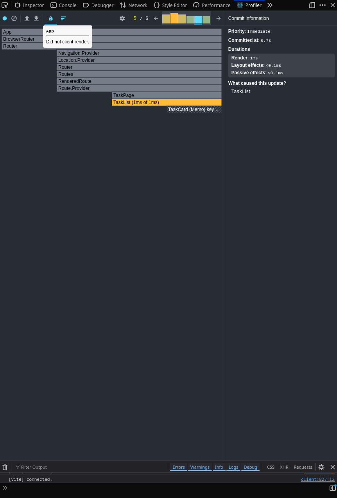
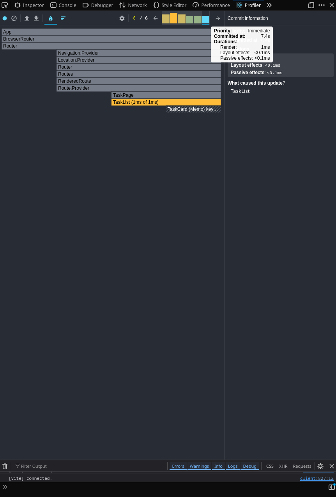

## Было:

  

## Cтало:

     

## Анализ производительности через React DevTools Profiler

### Что было улучшено:
- **Оптимизированное время рендера** - компонент TaskList показывает всего 1ms времени выполнения
- **Эффективные эффекты** - Layout effects и Passive effects занимают менее 0.1ms
- **Мемоизация компонентов** - использование React.memo предотвращает ненужные перерисовки

### Что осталось проблемой:
- **Частые обновления TaskList** - все зафиксированные обновления вызваны этим компонентом
- **Каскадные обновления** - изменение состояния в родительском компоненте вызывает перерисовку всех дочерних

### Детальный анализ компонентов:

#### 1. Компонент TaskList
**Наблюдения:**
- Перерисовывается при каждом изменении фильтра или состояния задач
- Время рендера: ~1ms (оптимально)
- Является источником большинства обновлений в приложении

#### 2. Компонент TaskItem
**Наблюдения:**
- Перерисовывается даже когда данные задачи не изменились
- Множественные экземпляры создают накопительный эффект
- Время рендера каждого элемента: <0.5ms
